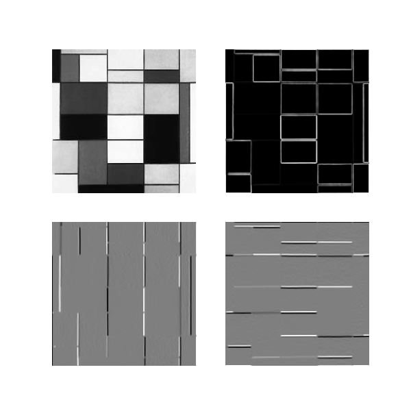

<!--
 * @Author: yitong 2969413251@qq.com
 * @Date: 2023-02-07 12:59:59
-->
# py_dl
A learning project about deep learning framework referring to matrixslow and needle
# build && run (have a try)
you should have installed [poetry](https://github.com/python-poetry/poetry), I use poetry for dependency management, there is an example
```
poetry update --lock && poetry install
poetry run python example/sobel.py
```
We can get Mondrian's work processed by a longitudinal Sobel filter, by a transverse Sobel filter, and by both simultaneously

# code statistics
use [tokei](https://github.com/XAMPPRocky/tokei) to get code statistics
```bash
# tokei .
===============================================================================
 Language            Files        Lines         Code     Comments       Blanks
===============================================================================
 Markdown                1           16            0           15            1
 Python                 32         2691         1727          190          774
 TOML                    1           23           20            0            3
===============================================================================
 Total                  34         2730         1747          205          778
===============================================================================
```
# to_do
- lstm operator
- grpc network serving
- Distributed training
# reference
- [matrixslow](https://github.com/zc911/MatrixSlow)
- [needle](https://github.com/dlsyscourse)
- [auto-format](https://zhuanlan.zhihu.com/p/203307235)
- [typing](https://juejin.cn/post/7021332689038868511)
- [matrix derivative](https://zhuanlan.zhihu.com/p/263777564)
- [A1 flatten ravel](https://blog.csdn.net/qq_45100273/article/details/104729269)
- [@ * np.dot() np.multiply() np.matmul()](https://www.cnblogs.com/ssyfj/p/12913015.html)
- [embedding](https://blog.csdn.net/hit0803107/article/details/98377030)
- [AUC](https://blog.csdn.net/u013385925/article/details/80385873)